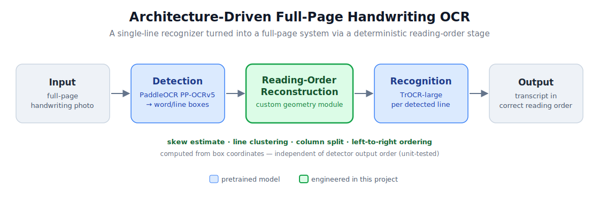

# HI-RES — Architecture-Driven Handwriting OCR

Full-page **English handwriting** OCR built by composing task-specific models with a
deterministic **reading-order reconstruction** stage — turning a single-line recognizer
into a system that transcribes whole pages in the correct order.



## Why this exists

Conventional OCR leaves a gap for full-page handwriting:

- **Generic OCR engines** (Tesseract, PaddleOCR) handle printed text well but are weak on handwriting.
- **Handwriting models** (Microsoft TrOCR) are strong on handwriting but only transcribe a **single cropped line** — not a page.

HI-RES bridges that gap: **PaddleOCR PP-OCRv5 detection → a custom reading-order reconstruction module → TrOCR-large line recognition → reassembled text.** The reading-order module is the engineered core — it recovers the true reading sequence from detected box geometry, so the output isn't a bag of randomly-ordered lines.

## How it works

1. **Detection** — PP-OCRv5 finds text regions and returns quadrilaterals.
2. **Reading-order reconstruction** (`pipeline.py`, pure NumPy/OpenCV, fully unit-tested):
   - page-skew estimation from box edge angles,
   - line clustering by vertical-band overlap,
   - left-to-right ordering within each line,
   - conservative column splitting for multi-column pages.
   Order is computed **only from coordinates**, so it is provably independent of the detector's output order.
3. **Recognition** — each line crop (perspective-rectified, padded) is read by TrOCR-large; long lines are chunked so they fit the model's input aspect ratio.
4. **Reassembly** — line texts are joined in reading order, with paragraph breaks inferred from vertical gaps.

## Results

Benchmarked on **GNHK** (172 real-world "handwriting-in-the-wild" photos), every system scored on the **same images** with one metric (corpus-level CER/WER, lower is better):

| System | CER | WER | Character accuracy |
|---|---|---|---|
| **HI-RES (this pipeline)** | **29.5%** | **67.5%** | **~70%** |
| Tesseract | 76.1% | 103.3% | ~24% |

→ **2.6× fewer character errors than Tesseract** (a 61% relative CER reduction). PaddleOCR's full det+rec pipeline is also wired up as a baseline in `evaluate.py` for head-to-head comparison.

> Note: GNHK is deliberately hard (camera-captured, unconstrained handwriting), and the recognizer is **stock** TrOCR-large (trained on IAM, not fine-tuned on GNHK) — so absolute CER has clear headroom. The result is strong *relative to deployable baselines*; fine-tuning the recognizer is the main accuracy lever (see Roadmap).

## Quickstart

```bash
pip install -r requirements.txt
```

The TrOCR weights (~2 GB) download automatically from the Hugging Face Hub on first run — nothing to commit or place manually.

```bash
# Gradio web UI
python app.py

# One image from the CLI (writes <name>_ocr.txt and a side-by-side panel image)
python app.py --image page.jpg
python app.py --image page.jpg --beams 4      # slightly higher accuracy, slower
```

A GPU is recommended for the recognizer; it falls back to CPU.

### Try it on Colab

Open `colab_ocr_debug.ipynb` in Google Colab (T4 GPU). It is self-contained: installs deps, runs the geometry tests, lets you upload your own photos, shows a numbered boxes-plus-transcript view, and includes the full evaluation harness.

## Evaluation

`evaluate.py` is a from-scratch harness scoring any system on the same data:

```bash
# your own labelled folder (image + sibling .txt ground truth)
python evaluate.py --data eval_data --baselines tesseract,paddleocr

# a public dataset from the Hugging Face Hub (IAM test lines)
python evaluate.py --hf iam-lines --n 200
```

Metrics: **CER / WER** (the headline) plus **WordAcc** — an order-free word accuracy that separates *recognition* errors from *reading-order* errors (high WordAcc + high CER ⇒ ordering issue; low WordAcc ⇒ recognition issue).

## Project structure

```
pipeline.py            # reading-order geometry (deskew, clustering, cropping) — NumPy/OpenCV only
ocr_engine.py          # Detector (PaddleOCR) + Recognizer (TrOCR) + OcrEngine.run()
app.py                 # Gradio UI + CLI
evaluate.py            # CER/WER + WordAcc harness, dataset loaders, baseline runners
make_colab_notebook.py # generates colab_ocr_debug.ipynb
colab_ocr_debug.ipynb  # self-contained Colab notebook
tests/                 # geometry + metric unit tests (no model needed) + end-to-end smoke tests
docs/ANALYSIS.md       # engineering audit of the original prototype and what was fixed/verified
```

## Limitations & roadmap

1. **Fine-tune the recognizer** on handwriting (GNHK/IAM/synthetic) — the biggest accuracy lever; converts a stock recognizer into a domain-tuned one.
2. **Document orientation** — pages rotated 90°/180° need an upfront orientation classifier.
3. **Mobile/web deployment** — TrOCR-large is the heavy component; a TrOCR-base or quantized/ONNX export is the path to on-device latency.
4. Tables, dense multi-column layouts, and non-Latin scripts are out of current scope.

## Acknowledgements

- [Microsoft TrOCR](https://huggingface.co/microsoft/trocr-large-handwritten) (recognition)
- [PaddleOCR PP-OCRv5](https://github.com/PaddlePaddle/PaddleOCR) (detection)
- [GNHK dataset](https://github.com/GoodNotes/GNHK-dataset) (evaluation, CC-BY-4.0)
